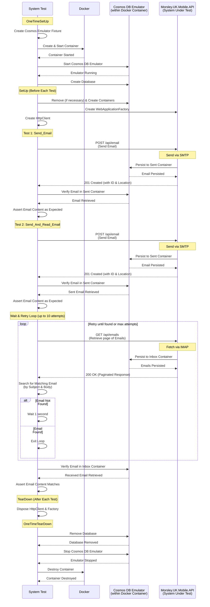

Morsley UK Mobile API SystemTests
=================================

The tests here test the complete API endpoints:

- Sending/recieving emails via the email servers IMAP/POP3 capabilites.
- Storing of these emails in an Azure Cosmos database.

If debugging, and you want to look at the Azure Cosmos DB Emulator from Microsoft UI screen, open Docker.
Locate the container, and note its port number. It be mapping port number 8081.
Then visit the following URL, replacing the mapped port number:

https://localhost:[Port Number]/_explorer/index.html

Prerequisites
-------------

1. Docker
2. The appsettings.SystemTest.json has an email IMAP server of 'mail.livemail.co.uk' and a SMTP server of 'smtp.livemail.co.uk'. These are my Fasthost's server and must be changed to yours. 
2. User Secrets, the following are essential:

```JSON
{
  "ImapSettings": {
    "Username": "john@morsley.uk",
    "Password": "W8r!xB2z@pT7f#M9kV3q*eSdY"
  },
  "SmtpSettings": {
    "Username": "john@morsley.uk",
    "Password": "W8r!xB2z@pT7f#M9kV3q*eSdY",
    "FromAddress": "john@morsley.uk"
  },
  "Data": {
    "ToAddress": "zjohn@morsley.ukz"
  },
  "TestSettings": {
    "ToEmailAddress": "john@morsley.uk"
  }
}
```    

Sequence Diagram
----------------

